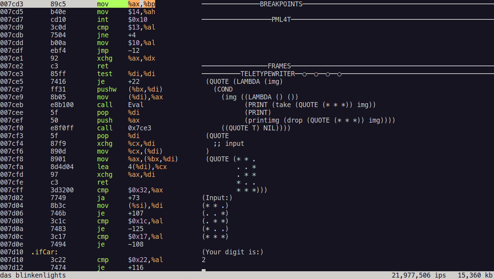
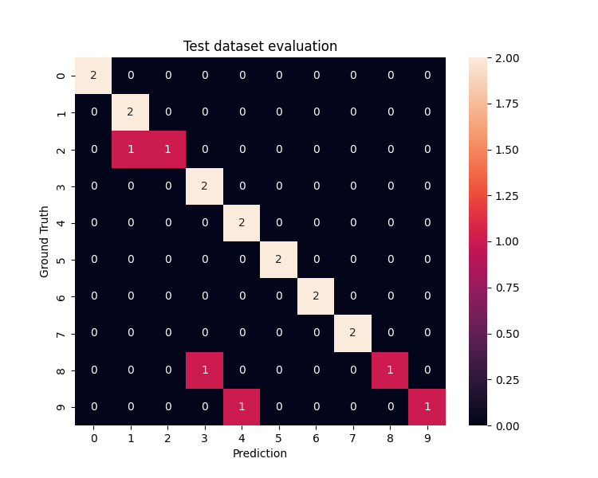

# A Neural Network Built in Pure Lisp Using Only Atoms and Lists


At the dawn of Lisp after its birth in 1958, Lisp was used as a language for creating advanced artificial intelligence.
This project makes that a reality once again by implementing a neural network for pattern recognition
written in pure lisp without built-in integers or floating-point numbers, that runs on the IBM PC model 5150.

Please see my blog post for a detailed description for training the network and implementing it in Lisp,
[Building a Neural Network in Pure Lisp Without Built-In Numbers Using Only Atoms and Lists](https://woodrush.github.io/blog/posts/2022-01-16-neural-networks-in-pure-lisp.html).


## Building Neural Networks Only Using Symbolic Manipulation
[SectorLISP](https://justine.lol/sectorlisp2/) is an amazing project
where a fully functional Lisp interpreter is fit into the 512 bytes of the boot sector of a floppy disk.
Since it works as a boot sector program, the binary can be written to a disk to be used as a boot drive,
where the computer presents an interface for writing and evaluating Lisp programs,
all running in the booting phase of bare metal on the 436-byte program.
I have written another blog post on SectorLISP about
[extending SectorLISP to implement BASIC REPLs and games](https://woodrush.github.io/blog/posts/2022-01-12-sectorlisp-io.html).

SectorLISP is implemented as a pure Lisp. In pure Lisp, there is _no_ built-in notion of integers or floating-point numbers,
and only supports atoms and lists as available data structures.
Surprisingly, even with the lack of numbers, such a Lisp is Turing-complete,
meaning that it is basically capable of any calculation that can be done on modern computers.

In this project, we implement a neural network that runs on SectorLISP.
Since there are no features of built-in numbers, we have to reinvent the notion of numbers from scratch only by using symbolic manipulation.
We first start off by constructing a fixed-point number calculation system based solely on list manipulations,
and finally, implement matrix multiplication and activation functions using this fixed-point number system.

Since SectorLISP runs on the IBM PC model 5150,
this implementation allows neural networks to run on the booting phase of vintage PCs.

The dataset, as well as the fully connected neural network model, were inspired by
a [blog post](https://aidiary.hatenablog.com/entry/20050505/1274165051) (in Japanese)
written by Koichiro Mori ([aidiary](https://profile.hatena.ne.jp/aidiary/)).


## Screenshots
Here are some screenshots of the neural network running
on the i8086 emulator [Blinkenlights](https://justine.lol/blinkenlights/).

Here are the results for the following input image:

```lisp
(QUOTE (* * *
        * . .
        * * *
        . . *
        * * *))
```


The network is also capable of predicting images that are not in the training dataset.
Here are the results for the following image:

```lisp
(QUOTE (* * .
        . . *
        . * *
        * . .
        * * *))
```



Instructions for running the neural network is explained in the next section.


## Usage
### Running the SectorLISP Program
Here are the instructions for running the neural network implemented in SectorLISP.

First, `git clone` the SectorLISP repository and `make` SectorLISP's binary, `sectorlisp.bin`:

```sh
git clone https://github.com/jart/sectorlisp
cd sectorlisp
git checkout io
make
```

This will generate `sectorlisp.bin` under `./sectorlisp`.

By building a [fork](https://woodrush.github.io/blog/posts/2022-01-12-sectorlisp-io.html)
of SectorLISP that supports I/O, an additional output with some messages indicating the input and the output will become printed.
Since the source code for this project is backwards comptible with the main SectorLISP branch,
the same code can be run on both versions.

To run SectorLISP on the i8086 emulator [Blinkenlights](https://justine.lol/blinkenlights/),
first follow the instructions on its [download page](https://justine.lol/blinkenlights/download.html)
and get the latest version:

```sh
curl https://justine.lol/blinkenlights/blinkenlights-latest.com >blinkenlights.com
chmod +x blinkenlights.com
```

You can then run SectorLISP by running:

```sh
./blinkenlights.com -rt sectorlisp.bin
```

In some cases, there might be a graphics-related error showing and the emulator may not start.
In that case, run the following command first available on the download page:

```sh
sudo sh -c "echo ':APE:M::MZqFpD::/bin/sh:' >/proc/sys/fs/binfmt_misc/register"
```

Running this command should allow you to run Blinkenlights on your terminal.

After starting Blinkenlights,
expand the size of your terminal large enough so that the `TELETYPEWRITER` region shows up
at the center of the screen.
This region is the console used for input and output.
Then, press `c` to run the emulator in continuous mode.
The cursor in the `TELETYPEWRITER` region should move one line down.
You can then start typing in text or paste a long code from your terminal into Blinkenlight's console
to run your Lisp program.

### Running on Physical Hardware
You can also run SectorLISP on an actual physical machine if you have a PC with an Intel CPU that boots with a BIOS,
and a drive such as a USB drive or a floppy disk that can be used as a boot drive.
First, mount your drive to the PC you've built sectorlisp.bin on, and check:

```sh
lsblk -o KNAME,TYPE,SIZE,MODEL
```

Among the list of the hardware, check for the device name for your drive you want to write SectorLISP onto.
After making sure of the device name, run the following command, replacing `[devicename]` with your device name.
`[devicename]` should be values such as `sda` or `sdb`, depending on your setup.

**Caution:** The following command used for writing to the drive
will overwrite anything that exists in the target drive's boot sector,
so it's important to make sure which drive you're writing into.
If the command or the device name is wrong,
it may overwrite the entire content of your drive or other drives mounted in your PC,
probably causing your computer to be unbootable
(or change your PC to a SectorLISP machine that always boots SectorLISP,
which is cool, but is hard to recover from).
Please perform these steps with extra care, and at your own risk.

```sh
sudo dd if=sectorlisp.bin of=/dev/[devicename] bs=512 count=1
```

After you have written your boot drive, insert the drive to the PC you want to boot it from.
You may have to change the boot priority settings from the BIOS to make sure the PC boots from the target drive.
When the drive boots successfully, you should see a cursor blinking in a blank screen,
which indicates that you're ready to type your Lisp code into bare metal.

## Training and Testing
The network is first trained using TensorFlow.
The obtained model parameters are then transferred to the Lisp impementation.


### Training
The training script is available at [./train/train.py](./train/train.py).
The Python package requirements are listted in [./train/requirements.txt](./train/requirements.txt)
and are as follows:

- Training
  - tensorflow
  - matplotlib
  - numpy
- Visualization
  - scikit-learn
  - seaborn
  - jupyterlab

The input images used for this network are 3x5 binary monochrome images,
all included as lists in [./train/dataset.py](./train/dataset.py).
The entire training and testing dataset can be visualized in a Jupyter Notebook
included in [./train/dataset.ipynb](./train/dataset.ipynb).
All of the images contained in the dataset is available in my [blog post](https://woodrush.github.io/blog/posts/2022-01-16-neural-networks-in-pure-lisp.html#the-dataset) for this project.

As mentioned before, the dataset, as well as the fully connected neural network model, were inspired by
a [blog post](https://aidiary.hatenablog.com/entry/20050505/1274165051) (in Japanese)
written by Koichiro Mori ([aidiary](https://profile.hatena.ne.jp/aidiary/)).

To run the training script, first `cd` to `./train`, and run:

```sh
cd train
python train.py
```

This will generate `params.h5` containing the model parameters
and will show the training-time accuracy of the network.


### Testing
To test the network, run:

```sh
python test.py
```

This will show the testing-time accuracy of the network,
and plot the test-time confusion matrix:



Since the training process involves randomized operations,
the resulting model parameters `params.h5` will not necessarily match with
those that are already included in this repository.


### Transferring the Model Parameters to the Lisp Implementation
The Lisp neural network implementation uses 18-bit fixed-point numbers,
instead of 64-bit floating point numbers that are used in the training process.
[./train/tolisp.py](./train/tolisp.py) converts the model parameters in `params.h5`
to this 18-bit fixed point format:

```sh
python tolisp.py
```

This will generate the files `A_1_T.lisp`, `B_1.lisp`, `A_2_T.lisp`, and `B_2.lisp`.
`B_1.lisp` and `B_2.lisp` are outputted as matrices, which are a list of vectors,
which are a list of scalars.
The outer parentheses for these files must be deleted
when being transferred to [nn.lisp](nn.lisp) to change the format from matrices to vectors.


## Impementation Details
The implementation details such as training the neural network
and implementing it in SectorLISP are available at my blog post,
[Building a Neural Network in Pure Lisp without Built-in Numbers using only Atoms and Lists](https://woodrush.github.io/blog/posts/2022-01-16-neural-networks-in-pure-lisp.html).
